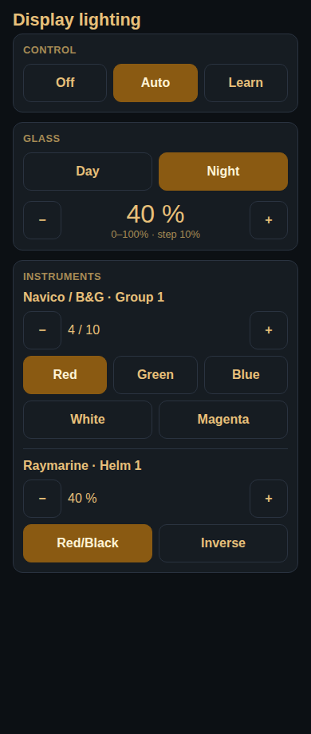

# signalk-n2k-displays

Signal K plugin that controls and syncs NMEA 2000 display devices from Raymarine and Navico.

You can control brightness, night mode, and colors via Signal K.

The plugin can also sync between the device manufacturers. So if you change brightness directly on a Raymarine device, the plugin will change it for Navico devices.

Requires signalk-server 2.3.0 or newer.

## Control webapp

Phone-first lighting control. Bookmark `/signalk-n2k-displays/` when glass is unreadable. Live PUT goes to v1 paths (`electrical.displays.*`). Control is **Manual**, **Auto**, or **Learning**. Time / Sun / Lux mapping is in the webapp on a large screen and in plugin config (same source). Brand **Day** and **Night** tables map brightness to B&G and Raymarine; Night has color next to each brand (select for all). Chrome follows the phone light/dark setting.

## Scope

**Job:** Own display lighting *policy*: light steering source → skipper brightness 0–1 and day/night → per-device native brightness and palette. Write those as Signal K paths. Provide a phone-first control webapp (Manual / Auto / Learning; wire `off` | `auto` | `auto-learning`).

**In:** Time / sun / lux steering (cascade lux → sun → time), glass paths `electrical.displays.{brightness,mode,control}`, maps, mapping table (large screen), group sync, power-on resync, PUT on v1 paths, one-major `environment.displayMode` mirror, embeddable webapp.

**Out:** NMEA 2000 encode (that is [signalk-to-nmea2000](https://github.com/SignalK/signalk-to-nmea2000) + canboatjs). Widescreen instrument layouts ([signalk-instrument-display-plugin](https://github.com/htool/signalk-instrument-display-plugin)). HEX PGN strings. simpleCan / second bus address. Garmin keypad until a lighting write protocol exists. Server `DisplayProvider`.

**Related:** [signalk-bandg-displaydaynight](https://github.com/htool/signalk-bandg-displaydaynight) is a stub that maps the old 1–10 blob onto `electrical.displays` brightness and mode and does not emit 130845.

## Deprecated `environment.displayMode`

For one major, this plugin mirrors `{ mode, backlight: round(brightness×10) }` and accepts the old PUT on `environment.displayMode.control`. Migrate to `electrical.displays.brightness` (0–1) and `.mode`. Details: [docs/displayMode-compat.md](docs/displayMode-compat.md).

Agents: start at [AGENTS.md](AGENTS.md) (`CLAUDE.md` is the same pointer). Features and ADRs are under [docs/](docs/). Process traps: [docs/dev-lessons.md](docs/dev-lessons.md). Showcase writeup: [docs/showcase.md](docs/showcase.md).
